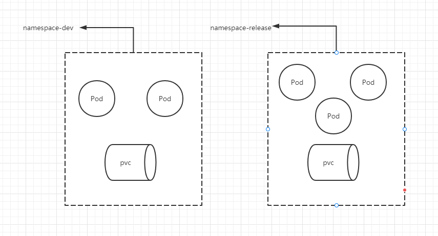
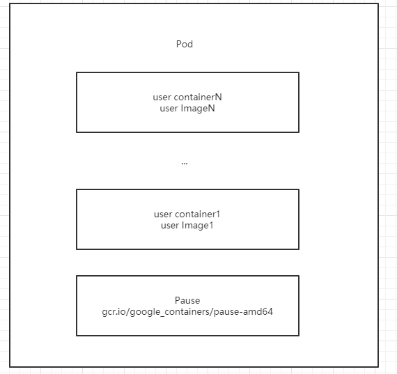
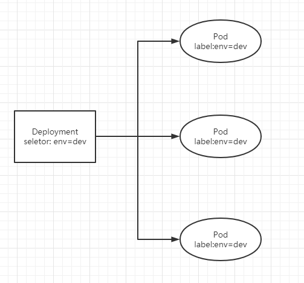
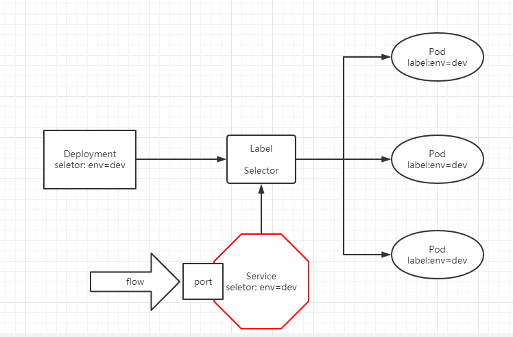

<!--
 * @Author: moment-forever lzt1141@126.com
 * @Date: 2022-07-11 15:25:36
 * @LastEditors: moment-forever lzt1141@126.com
 * @LastEditTime: 2022-07-14 11:34:56
 * @FilePath: /workspace/MyBlog/K8S笔记/资源管理.md
 * @Description: 这是默认设置,请设置`customMade`, 打开koroFileHeader查看配置 进行设置: https://github.com/OBKoro1/koro1FileHeader/wiki/%E9%85%8D%E7%BD%AE
-->
# 资源管理

## 资源管理方式 

+ 命令式对象管理: 直接使用命令去操作kubernetes资源
> ``kubectl run nginx-pod --image=nginx:1.17.1 --port=80``
+ 命令式对象配置: 通过命令配置和配置文件去操作kubernetes资源
> ``kubectl create/patch -f nginx-pod.yaml``
+ 声明式对象配置: 通过apply命令和配置文件去操作kubernetes资源
> ``kubectl apply -f nginx-pod.yaml``

| 类型           | 操作 | 适用环境 | 优点           | 缺点                             |
| -------------- | ---- | -------- | -------------- | -------------------------------- |
| 命令式对象管理 | 对象 | 测试     | 简单           | 只能操作活动对象，无法审计、追踪 |
| 命令时对象配置 | 文件 | 开发     | 可以审计、追踪 | 项目大时，配置文件多，操作麻烦   |
| 声明式对象配置 | 目录 | 开发     | 支持目录操作   | 意外情况下难以调试               |

## 命令式对象管理

> ``kubectl``命令

```powershell
kubectl [command] [type] [name] [flags] 
```

**command**: 指定要对资源执行的操作，例如create/get/delete

**type**: 指定资源类型，例如deployment/pod/service

**name**: 指定资源的名称，名称大小写敏感

**flags**: 指定额外的可选参数

```powershell

# 查看所有pod
kubectl get pod

# 查看某个pod
kubectl get pod pod_name

# 查看某个pod，以yaml格式展示结果
kubectl get pod pod_name -o yaml
```


### 资源操作


> ``--help``可以查看详细的操作命令

```powershell
kubectl --help
```

+ 基础命令

|命令|翻译|命令作用|
|---|---|---|
|create|创建|创建一个资源|
|edit|编辑|编辑一个资源|
|get|获取|获取一个资源|
|patch|更新|更新一个资源|
|delete|删除|删除一个资源|
|explain|解释|展示资源文档|

+ 运行和调试

|命令|翻译|命令作用|
|---|---|---|
|run|运行|在集群中运行一个指定的镜像|
|expose|暴露|暴露资源为Service|
|describe|描述|显示内部资源信息|
|logs|日志|输出容器在pod中的日志|
|attach|附着|直接进入运行中的容器|
|exec|执行|在容器中执行一个命令|
|cp|复制|在Pod内外复制文件|
|rollout|首次展示|管理资源的发布|
|scale|调整|扩(缩)容Pod的数量|
|autoscale|自动调整|自动调整Pod的数量|

+ 高级命令

|命令|翻译|命令作用|
|---|---|---|
|apply|rc|通过文件对资源进行配置|
|label|标记|更新资源上的标签|

+ 其他命令
  
|命令|翻译|命令作用|
|---|---|---|
|cluster-info|集群信息|显示集群信息|
|version|版本|显示当前Server和Client的版本|

### 资源类型


> ``api-resources``可以查看详细的资源

```powershell
kubectl api-resources
```

<table>
    <tr>
        <td>资源分类</td>
        <td>资源名称</td>
        <td>缩写</td>
        <td>资源组作用</td>
    </tr>
    <tr>
      <td rowspan="2">集群级别资源</td>
      <td>nodes</td>
      <td>no</td>
      <td>装载容器</td>  
    </tr>
    <tr>
      <td>namespace</td>
      <td>ns</td>
      <td>隔离Pod</td>  
    </tr>
    <tr>
      <td rowspan="1">Pod资源</td>
      <td>pods</td>
      <td>po</td>
      <td>控制Pod资源</td>  
    </tr>
    <tr>
      <td rowspan="8">Pod资源控制器</td>
      <td>replicationcontrollers</td>
      <td>rc</td>
      <td>控制Pod资源</td>  
    </tr>
    <tr>
      <td>replicasets</td>
      <td>rs</td>
      <td>控制Pod资源</td>  
    </tr>
    <tr>
      <td>deployments</td>
      <td>ds</td>
      <td>控制Pod资源</td>  
    </tr>
    <tr>
      <td>daemonsets</td>
      <td>ds</td>
      <td>控制Pod资源</td>  
    </tr>
    <tr>
      <td>jobs</td>
      <td></td>
      <td>控制Pod资源</td>  
    </tr>
    <tr>
      <td>cronjobs</td>
      <td>cj</td>
      <td>控制Pod资源</td>  
    </tr>
    <tr>
      <td>horizontalpodautonscalers</td>
      <td>hps</td>
      <td>控制Pod资源</td>  
    </tr>
    <tr>
      <td>statefulsets</td>
      <td>sts</td>
      <td>控制Pod资源</td>  
    </tr>
    <tr>
      <td rowspan="2">服务发现资源</td>
      <td>services</td>
      <td>svc</td>
      <td>统一Pod对外接口</td>  
    </tr>
    <tr>
      <td>ingress</td>
      <td>ing</td>
      <td>统一Pod对外接口</td>  
    </tr>
    <tr>
      <td rowspan="3">存储资源</td>
      <td>volumeattachments</td>
      <td></td>
      <td>存储</td>  
    </tr>
    <tr>
      <td>persistentvolumes</td>
      <td>pv</td>
      <td>存储</td>  
    </tr>
    <tr>
      <td>persistentvolumeclaims</td>
      <td>pvc</td>
      <td>存储</td>  
    </tr>
    <tr>
      <td rowspan="2">配置资源</td>
      <td>configmaps</td>
      <td>cm</td>
      <td>配置</td>  
    </tr>
    <tr>
      <td>secrets</td>
      <td></td>
      <td>配置</td>  
    </tr>
</table>

### Demo

```powershell
# 创建一个namespace
[root@master ~]# kubectl create namespace dev
namespace/dev created

# 获取namespace
[root@master ~]# kubectl get ns
NAME              STATUS   AGE
default           Active   173m
dev               Active   28s
kube-flannel      Active   153m
kube-node-lease   Active   173m
kube-public       Active   173m
kube-system       Active   173m

# 在此namespace下创建并运行一个nginx的Pod
[root@master ~]# kubectl run pod --image=nginx -n dev
kubectl run --generator=deployment/apps.v1 is DEPRECATED and will be removed in a future version. Use kubectl run --generator=run-pod/v1 or kubectl create instead.
deployment.apps/pod created

# 查看新创建的Pod
[root@master ~]# kubectl get pod -n dev
NAME                   READY   STATUS    RESTARTS   AGE
pod-864f9875b9-g4cjc   1/1     Running   0          68s

# 删除指定的Pod，需要指定namespace
[root@master ~]# kubectl delete pod pod-864f9875b9-g4cjc -n dev
pod "pod-864f9875b9-g4cjc" deleted

# 删除指定的namespace
[root@master ~]# kubectl delete ns dev
namespace "dev" delete
```

## 命令式对象配置

命令式对象配置就是使用命令配合配置文件一起来操作kubernetes资源


### 创建一个nginxpod.yaml

```yaml
apiVersion: v1
kind: Namespace
metadata:
  name: dev

---

apiVersion: v1
kind: Pod
metadata:
  name: nginxpod
  namespace: dev
spec:
  containers:
  - name: nginx-containers
    image: nginx:1.17.1
```

### 执行``create``命令，创建资源

```powershell
[root@master ~]# kubectl create -f nginxpod.yaml
namespace/dev created
pod/nginxpod created
```

此时啊发现创建了两个资源对象，分别是namespace和pod  

### 执行``get``命令，查看资源

```powershell
[root@master ~]# kubectl get -f nginxpod.yaml 
NAME            STATUS   AGE
namespace/dev   Active   16h

NAME           READY   STATUS    RESTARTS   AGE
pod/nginxpod   1/1     Running   0          16h
```

### 执行``delete``命令，删除资源

```powershell
[root@master ~]# kubectl delete -f nginxpod.yaml 
namespace "dev" deleted
pod "nginxpod" deleted
```


## 声明式对象配置

```powershell
# 首次执行，创建资源
[root@master ~]# kubectl apply -f nginxpod.yaml 
namespace/dev created
pod/nginxpod created

# 再次执行，校验并更新资源
[root@master ~]# kubectl apply -f nginxpod.yaml 
namespace/dev unchanged
pod/nginxpod unchanged
```

## Namespace



Namespace是kubernetes系统中的一种非常重要资源，它的主要作用是用来实现**多套环境的资源隔离**或者**多租户的资源隔离**。

默认情况下，kubernetes集群中的所有的Pod都是可以相互访问的。但是在实际中，可能不想让两个Pod之间进行互相的访问，那此时就可以将两个Pod划分到不同的namespace下。

kubernetes通过将集群内部的资源分配到不同的Namespace中，可以形成逻辑上的"组"，以方便不同的组的资源进行隔离使用和管理。

可以通过kubernetes的授权机制，将不同的namespace交给不同租户进行管理，这样就实现了多租户的资源隔离。此时还能结合kubernetes的资源配额机制，限定不同租户能占用的资源，例如CPU使用量、内存使用量等等，来实现租户可用资源的管理。

### 创建

```powershell
[root@master ~]# kubectl create ns dev
namespace/dev created
```

### 查询

```powershell
# 查看所有Namespace
[root@master ~]# kubectl  get namespace
NAME              STATUS   AGE
default           Active   45h     #  所有未指定Namespace的对象都会被分配在default命名空间
kube-node-lease   Active   45h     #  集群节点之间的心跳维护，v1.13开始引入
kube-public       Active   45h     #  此命名空间下的资源可以被所有人访问（包括未认证用户）
kube-system       Active   45h     #  所有由Kubernetes系统创建的资源都处于这个命名空间

# 查询指定namespace
[root@master ~]# kubectl get ns default
NAME      STATUS   AGE
default   Active   23h

# 查看namespace详情
[root@master ~]# kubectl describe ns default
Name:         default
Labels:       <none>
Annotations:  <none>
Status:       Active
# ResourceQuota 针对namespace做的资源限制
No resource quota.
# LimitRange针对namespace中的每个组件做的资源限制
No LimitRange resource.
```


### 删除

```powershell
[root@master ~]# kubectl delete ns dev
namespace "dev" deleted
```


### 配置文件

```yaml
# ns-dev.yaml
apiVersion: v1
kind: Namespace
metadata:
  name: dev
```

```powershell
# 创建
[root@master ~]# kubectl create -f ns-dev.yaml

# 删除
[root@master ~]# kubectl delete -f ns-dev.yaml
```

## Pod



Pod是kubernetes集群进行管理的最小单元，程序要运行必须部署在容器中，而容器必须存在于Pod中。

Pod可以认为是容器的封装，一个Pod中可以存在一个或者多个容器。

```powershell
# 查看kubernetes默认Pod组件
[root@master ~]#  kubectl get pod -n kube-system
NAME                             READY   STATUS    RESTARTS   AGE
coredns-9d85f5447-cqdcj          1/1     Running   0          47h
coredns-9d85f5447-mxz4c          1/1     Running   0          47h
etcd-master                      1/1     Running   0          47h
kube-apiserver-master            1/1     Running   0          47h
kube-controller-manager-master   1/1     Running   2          47h
kube-proxy-4j7nd                 1/1     Running   0          47h
kube-proxy-bkwzp                 1/1     Running   0          47h
kube-proxy-nwg7z                 1/1     Running   0          47h
kube-scheduler-master            1/1     Running   1          47h
```

### 创建并运行
kubernetes没有提供单独创建并运行Pod的命令，都是以Pod控制器来实现创建并运行Pod功能的。

> Pod控制器：在删除Pod后会自动重新创建一个新的Pod，来代替。

```powershell
[root@master ~]# kubectl run nginx --image=nginx:latest --port=80 --namespace dev
kubectl run --generator=deployment/apps.v1 is DEPRECATED and will be removed in a future version. Use kubectl run --generator=run-pod/v1 or kubectl create instead.
deployment.apps/nginx created
```

### 查询

```powershell
# 查看ns下所有Pod的基本信息
[root@master ~]# kubectl get pods -n dev
NAME                    READY   STATUS    RESTARTS   AGE
nginx-dd6b5d745-klpgx   1/1     Running   0          4m12s

# 查看Pod的详细信息
[root@master ~]# kubctl describe pod nginx -n dev
-bash: kubctl: command not found
[root@master ~]# kubectl describe pod nginx -n dev
Name:         nginx-dd6b5d745-klpgx
Namespace:    dev
Priority:     0
Node:         node2/192.168.123.106
Start Time:   Wed, 13 Jul 2022 14:17:50 +0800
Labels:       pod-template-hash=dd6b5d745
              run=nginx
Annotations:  <none>
Status:       Running
IP:           10.244.1.6
IPs:
  IP:           10.244.1.6
Controlled By:  ReplicaSet/nginx-dd6b5d745
Containers:
  nginx:
    Container ID:   docker://1623dcf9ed49aa40627c6415c02cef6cb8984390d29a8d5cb99c5a55ab065795
    Image:          nginx:latest
    Image ID:       docker-pullable://nginx@sha256:0d17b565c37bcbd895e9d92315a05c1c3c9a29f762b011a10c54a66cd53c9b31
    Port:           80/TCP
    Host Port:      0/TCP
    State:          Running
      Started:      Wed, 13 Jul 2022 14:18:07 +0800
    Ready:          True
    Restart Count:  0
    Environment:    <none>
    Mounts:
      /var/run/secrets/kubernetes.io/serviceaccount from default-token-5nnmn (ro)
Conditions:
  Type              Status
  Initialized       True 
  Ready             True 
  ContainersReady   True 
  PodScheduled      True 
Volumes:
  default-token-5nnmn:
    Type:        Secret (a volume populated by a Secret)
    SecretName:  default-token-5nnmn
    Optional:    false
QoS Class:       BestEffort
Node-Selectors:  <none>
Tolerations:     node.kubernetes.io/not-ready:NoExecute for 300s
                 node.kubernetes.io/unreachable:NoExecute for 300s
Events:
  Type    Reason     Age        From               Message
  ----    ------     ----       ----               -------
  Normal  Scheduled  <unknown>  default-scheduler  Successfully assigned dev/nginx-dd6b5d745-klpgx to node2
  Normal  Pulling    5m24s      kubelet, node2     Pulling image "nginx:latest"
  Normal  Pulled     5m9s       kubelet, node2     Successfully pulled image "nginx:latest"
  Normal  Created    5m9s       kubelet, node2     Created container nginx
  Normal  Started    5m8s       kubelet, node2     Started container nginx
```

### 访问


```powershell
# 获取Pod的IP地址
[root@master ~]# kubectl get pods -n dev -o wide
NAME                    READY   STATUS    RESTARTS   AGE    IP           NODE    NOMINATED NODE   READINESS GATES
nginx-dd6b5d745-klpgx   1/1     Running   0          7m6s   10.244.1.6   node2   <none>           <none>

# 访问Nginx的Pod
[root@master ~]# curl http://10.244.1.6
<!DOCTYPE html>
<html>
<head>
<title>Welcome to nginx!</title>
<style>
html { color-scheme: light dark; }
body { width: 35em; margin: 0 auto;
font-family: Tahoma, Verdana, Arial, sans-serif; }
</style>
</head>
<body>
<h1>Welcome to nginx!</h1>
<p>If you see this page, the nginx web server is successfully installed and
working. Further configuration is required.</p>

<p>For online documentation and support please refer to
<a href="http://nginx.org/">nginx.org</a>.<br/>
Commercial support is available at
<a href="http://nginx.com/">nginx.com</a>.</p>

<p><em>Thank you for using nginx.</em></p>
</body>
</html>
```

### 删除


```powershell
# 删除指定Pod
[root@master ~]# kubectl delete pod nginx-dd6b5d745-klpgx -n dev
pod "nginx-dd6b5d745-klpgx" deleted

# 删除成功后再次查询
[root@master ~]# kubectl get pods -n dev
NAME                    READY   STATUS    RESTARTS   AGE
nginx-dd6b5d745-k4mtg   1/1     Running   0          58s
```

这是因为当前Pod是由Pod控制器创建的，控制器会监控Pod状况，一旦发现Pod死亡，会立即重建。

此时要想删除Pod，必须删除Pod控制器。

```powershell
# 查询namespace下Pod控制器
[root@master ~]# kubectl get deploy -n dev
NAME    READY   UP-TO-DATE   AVAILABLE   AGE
nginx   1/1     1            1           12m

# 删除此Pod的Pod控制器
[root@master ~]# kubectl delete deploy nginx -n dev
deployment.apps "nginx" deleted

# wait，再次查询Pod，Pod被删除
[root@master ~]# kubectl get pods -n dev
No resources found in dev namespace.
```

### 配置文件

```yaml
# pod-nginx.yaml
apiVersion: v1
kind: Pod
metadata:
  name: nginx
  namespace: dev
spec:
  containers:
  - image: nginx:latest
    name: pod
    ports: 
    - name: nginx-port
      containerPort: 80
      protocol: TCP
```

```powershell
# 创建
[root@master ~]# kubectl create -f pod-nginx.yaml

# 删除
[root@master ~]# kubectl delete -f pod-nginx.yaml
```

这种方式删除的Pod不受控制器影响。

## Label

Label是kubernetes系统中的一个重要概念。它的作用就是在资源上添加标识，用来对它们进行区分和选择。

Label特点：

+ 一个Label会以key/value键值对的形式附加到各种对象上，如Node、Pod、Service...
+ 一个资源对象可以定义任意数量的Label，同一个Label也可以被添加到任意数量的资源对象上去
+ Label通常在资源对象定义时确定，当然也可以在对象创建后动态添加或者删除
  
> 一些常用的Label 示例如下：
> + 版本标签："version":"release", "version":"stable"...
> + 环境标签："environment":"dev"，"environment":"test"，"environment":"pro"...
> + 架构标签："tier":"frontend"，"tier":"backend"...

标签定义完毕之后，还要考虑到标签的选择（查询/筛选），这就要使用到Label Selector。

两种Label Selector:

+ 基于等式的Label Selector
  + = name = slave : 选择所有包含Label中key="name"且value="slave"的对象
  + env != production: 选择所有包括Label中的key="env"且value不等于"production"的对象
+ 基于集合的Label Selector
  + name in (master, slave): 选择所有包含Label中的key="name"且value="master"或"slave"的对象
  + name not in (frontend): 选择所有包含Label中的key="name"且value不等于"frontend"的对象

标签的选择条件可以使用多个，此时将多个Label Selector进行组合，使用逗号","进行分隔即可。

+ name=slave，env!=production
+ name not in (frontend)，env!=production

### 创建

```powershell
# 创建标签
[root@master ~]# kubectl label pod nginx version=1.0 -n dev
pod/nginx labeled
```

### 更新

```powershell
[root@master ~]# kubectl label pod nginx version=1.1 -n dev --overwrite
pod/nginx labeled
```

### 查询

```powershell
# 查询
[root@master ~]# kubectl get pod nginx -n dev --show-labels
NAME    READY   STATUS    RESTARTS   AGE     LABELS
nginx   1/1     Running   0          3m40s   version=1.1

# 筛选
[root@master ~]# kubectl get pod -n dev -l version=1.1 --show-labels
NAME    READY   STATUS    RESTARTS   AGE     LABELS
nginx   1/1     Running   0          2m37s   version=1.1
```

### 删除
```powershell
[root@master ~]# kubectl label pod nginx version- -n dev
pod/nginx labeled
```

### 配置文件

```yaml
# lab-nginx.yaml
apiVersion: v1
kind: Pod
metadata: 
  name: nginx
  namespace: dev
  labels:
    version: "3.0"
    env: "test"
spec:
  containers:
  - image: nginx:latest
    name: pod
    ports: 
    - name: nginx-port
      containerPort: 80
      protocol: TCP
```

```powershell
# 创建
[root@master ~]# kubectl create -f lab-nginx.yaml

# 删除
[root@master ~]# kubectl delete -f lab-nginx.yaml
```

## Deployment

在kubernetes中，Pod是最小的控制单元，但是kubernetes很少直接控制Pod，一般都是通过Pod控制器来完成的。Pod控制器用于Pod的管理，确保Pod资源符合预期的状态，当Pod的资源出现故障时，会尝试进行重启或重建Pod。

在kubernetes中Pod控制器的种类有很多，本章节只介绍一种：Deployment


### 创建

```powershell
# 命令格式: kubectl create deployment <名称>  [参数] 
# --image  指定pod的镜像
# --port   指定端口
# --replicas  指定创建pod数量
# --namespace  指定namespace
[root@master ~]# kubectl run nginx --image=nginx:latest --port=80 --replicas=2 -n dev
kubectl run --generator=deployment/apps.v1 is DEPRECATED and will be removed in a future version. Use kubectl run --generator=run-pod/v1 or kubectl create instead.
deployment.apps/nginx created

# 查看是否成功创建Pod
[root@master ~]# kubectl get pods -n dev
NAME                    READY   STATUS    RESTARTS   AGE
nginx-dd6b5d745-cgmtj   1/1     Running   0          40s
nginx-dd6b5d745-gxgxd   1/1     Running   0          40s
```

### 查询

```powershell
[root@master ~]# kubectl get deploy -n dev
NAME    READY   UP-TO-DATE   AVAILABLE   AGE
nginx   2/2     2            2           39m

# UP-TO-DATE：成功升级的副本数量
# AVAILABLE：可用副本的数量
[root@master ~]# kubectl get deploy -n dev -o wide
NAME    READY   UP-TO-DATE   AVAILABLE   AGE   CONTAINERS   IMAGES         SELECTOR
nginx   2/2     2            2           37m   nginx        nginx:latest   run=nginx

# 查看详细信息
nginx   2/2     2            2           39m
[root@master ~]# kubectl describe deploy nginx -n dev
Name:                   nginx
Namespace:              dev
CreationTimestamp:      Thu, 14 Jul 2022 09:56:47 +0800
Labels:                 run=nginx
Annotations:            deployment.kubernetes.io/revision: 1
Selector:               run=nginx
Replicas:               2 desired | 2 updated | 2 total | 2 available | 0 unavailable
StrategyType:           RollingUpdate
MinReadySeconds:        0
RollingUpdateStrategy:  25% max unavailable, 25% max surge
Pod Template:
  Labels:  run=nginx
  Containers:
   nginx:
    Image:        nginx:latest
    Port:         80/TCP
    Host Port:    0/TCP
    Environment:  <none>
    Mounts:       <none>
  Volumes:        <none>
Conditions:
  Type           Status  Reason
  ----           ------  ------
  Available      True    MinimumReplicasAvailable
  Progressing    True    NewReplicaSetAvailable
OldReplicaSets:  <none>
NewReplicaSet:   nginx-dd6b5d745 (2/2 replicas created)
Events:
  Type    Reason             Age   From                   Message
  ----    ------             ----  ----                   -------
  Normal  ScalingReplicaSet  39m   deployment-controller  Scaled up replica set nginx-dd6b5d745 to 2
```

### 删除

```powershell
[root@master ~]# kubectl delete deploy nginx -n dev
deployment.apps "nginx" deleted
```

### 配置文件

```yaml
# deploy-nginx.yaml
apiVersion: apps/v1
kind: Deployment
metadata:
  name: nginx
  namespace: dev
spec:
  replicas: 2
  selector:
    matchLabels:
      run: nginx
  template:
    metadata:
      labels:
        run: nginx
    spec:
      containers:
        - image: nginx:latest
          name: nginx
          ports:
          - containerPort: 80
            protocol: TCP
```

```powershell
# 创建
[root@master ~]# kubectl create -f deploy-nginx.yaml

# 删除
[root@master ~]# kubectl delete -f deploy-nginx.yaml
```

## Service



虽然每个Pod都会分配一个单独的Pod IP，然而却存在如下两问题：

+ Pod IP 会随着Pod的重建产生变化
+ Pod IP 仅仅是集群内可见的虚拟IP，外部无法访问

这样对于访问这个服务带来了难度。因此，kubernetes设计了Service来解决这个问题。

Service可以看作是一组同类Pod**对外的访问接口**。借助Service，应用可以方便地实现服务发现和负载均衡。

### 创建

+ --type
  + ClusterIP: 集群内部访问
  + NodePort: 对外暴露
```powershell
# 需要在已经创建好Deploy的基础上暴露Service
[root@master ~]# kubectl expose deploy nginx --name=svc-nginx1 --type=ClusterIP --port=80 --target-port=80 -n dev
service/svc-nginx1 exposed
```

### 查询

```powershell
[root@master ~]# kubectl get svc svc-nginx1 -n dev -o wide
NAME         TYPE        CLUSTER-IP    EXTERNAL-IP   PORT(S)   AGE     SELECTOR
svc-nginx1   ClusterIP   10.111.69.8   <none>        80/TCP    3m55s   run=nginx
```

### 删除

```powershell
[root@master ~]# kubectl delete svc svc-nginx1 -n dev
service "svc-nginx1" deleted
```


### 配置文件
```yaml
# svc-nginx.yaml
apiVersion: v1
kind: Service
metadata:
  name: svc-nginx
  namespace: dev
spec:
  clusterIP: 10.109.179.231 # 固定svc的内网IP
  ports:
  - port: 80
    protocol: TCP
    targetPort: 80
  selector:
    run: nginx
  type: ClusterIP
```

```powershell
# 创建
[root@master ~]# kubectl create -f svc-nginx.yaml

# 删除
[root@master ~]# kubectl delete -f svc-nginx.yaml
```

