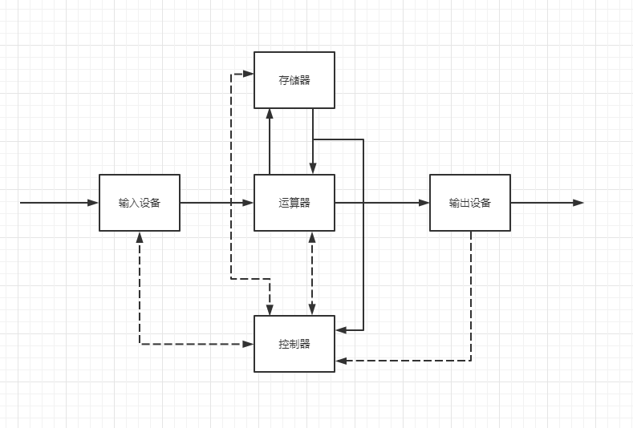
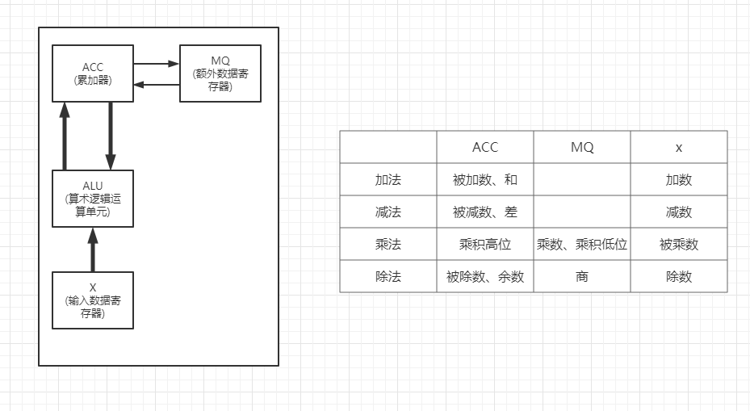
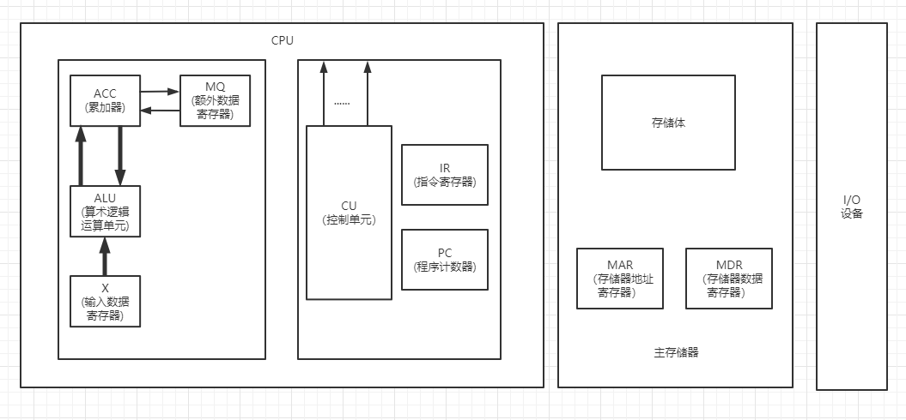
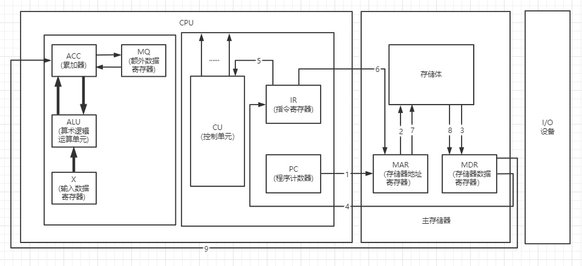
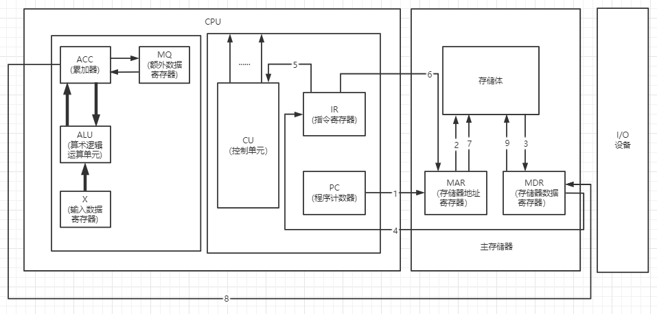

<!--
 * @Author: your name
 * @Date: 2022-04-01 16:52:15
 * @LastEditTime: 2022-04-02 16:36:12
 * @LastEditors: Please set LastEditors
 * @Description: 打开koroFileHeader查看配置 进行设置: https://github.com/OBKoro1/koro1FileHeader/wiki/%E9%85%8D%E7%BD%AE
 * @FilePath: /workspace/MyBlog/计算机组成原理笔记/第一章-计算机系统简介.md
-->
# 第一章-计算机系统简介

## 计算机系统的组成

+ 计算机硬件
+ 计算机软件
  + 系统软件
  + 应用软件 
  
## 计算机系统的层次结构

从顶向下依次为：

---------
> 软件

1. 高级语言（虚拟机器M3）
2. 汇编语言（虚拟机器M2）
3. 操作系统（虚拟机器）
   
---------
> 硬件

4. 机器语言（实际机器M1）
5. 微指令系统（微程序机器M0）

+ 计算机体系结构

> 有无乘法指令

程序员所见到的计算机系统的属性

概念性的结构域功能特性

（指令系统、数据类型、寻址技术、I/O原理）

+ 计算机组成

> 如何实现乘法指令

实现计算机体系结构所体现的属性

（具体指令的实现）

## 计算机的基本组成

### 冯诺依曼计算机的特点

1. 计算机由五大部分组成
   + 运算器
   + 控制器
   + 存储器
   + 输入
   + 输出
2. 指令和数据以同等地位存于存储器，可按地址寻访
3. 指令和数据用二进制表示
4. 指令由操作码和地址码组成
5. ``存储程序``
6. 以运算器为中心

### 冯诺依曼计算机硬件框图

### 现代计算机硬件框体

+ 硬件
  + IO设备
    + 输入
    + 输出
  + 主机
    + CPU
      + 运算器(ALU)
      + 控制器(CPU)
    + 主存/辅存
      + 存储器

+ 系统复杂性管理方法
  + 层次化(Hierachy): 将被设计的系统划分为多个模块或子模块
  + 模块化(Modularity): 有明确定义(well-defined)的功能和接口
  + 规则性(regularity): 模块更容易被重用

### 存储器的基本组成

+ 主存储器
  + 存储体
  + MAR(存储器地址寄存器)
  + MDR(存储器数据缓冲寄存器)

+ ``存储体``(大楼)
+ ``存储单元``(房间) : 存放一串二进制代码
+ ``存储字``(床位(有人/无人)) : 存储单元中二进制代码的组合
+ ``存储字长`` : 存储单元中二进制代码的位数
  
每一个存储单元赋予一个地址。

> MAR(存储器地址寄存器)

反映存储单元的个数

> MDR(存储器数据寄存器)

反应存储字长

### 运算器的基本组成

#### 加法操作过程

> 指令: 加 M

1. 初态 
  + ACC 被加数
  + [M] -> X
2. [ACC] -> ALU & [X] -> ALU
3. [ACC]+[X] -> ACC

#### 减法操作过程

> 指令: 减 M

1. 初态 
  + ACC 被减数
  + [M] -> X
2. [ACC] -> ALU & [X] -> ALU
3. [ACC]+[X] -> ACC

#### 乘法操作过程

二进制乘法：移位累加

> 指令: 乘 M

1. 初态 
  + ACC 被乘数
  + [M] -> MQ
  + [ACC]-> X
  + 0 -> ACC
2. [X]*[MQ] -> ACC(高)//MQ(低)

#### 除法操作过程

> 指令: 除 M

1. 初态 
  + ACC 被除数
  + [M] -> MQ
  + [ACC]-> X
2. [ACC]/[X] -> MQ

余数在ACC中，商在MQ中。

### 控制器的基本组成

#### 控制器的功能

+ 解释指令
+ 保证指令的按顺序执行

> 完成一条指令
1. 取指令 PC
2. 分析指令 IR
3. 执行指令 CU

``PC`` 存放当前欲执行指令的地址，具有计数功能(PC) + 1 -> PC。

``IR`` 存放当前欲执行的指令。

``CU`` 根据指令所需完成的操作和信号，发出各种微操作命令序列，用以控制所有被控对象，完成指令的执行。

### 主机架构

#### 主机完成一条指令的过程

+ 取指令

1. PC把指令的地址送给MAR
2. MAR把指令的地址送给存储体
3. 在控制器的控制下，存储体把指定存储体单元保存的取数指令取出，送给MDR
4. MDR中取出来的指令送给IR

+ 分析指令

5. IR将指令的操作码送给CU

+ 取数

6. PC把数的地址送给MAR
7. MAR把数的地址送给储存体
8. 在控制器的控制下，存储体把指定存储体单元保存的值取出，送给MDR
9. MDR中的值送给ACC

+ 取指令/分析指令

1-5 同取数指令

+ 存数

6. PC把要存放的地址送给MAR
7. MAR把存放的地址送给储存体
8. ACC把存放的值送给MDR
9. 把MDR中存放的值存放到存储体中