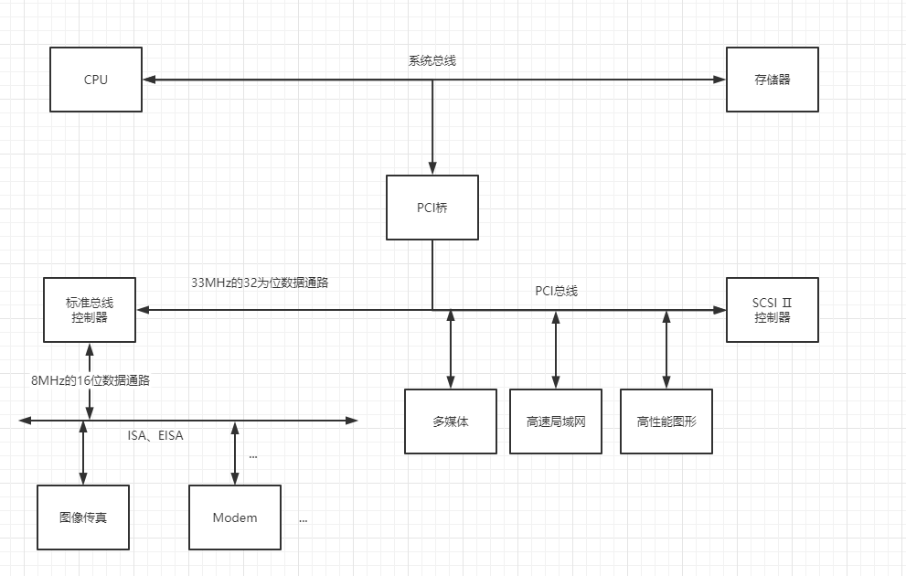
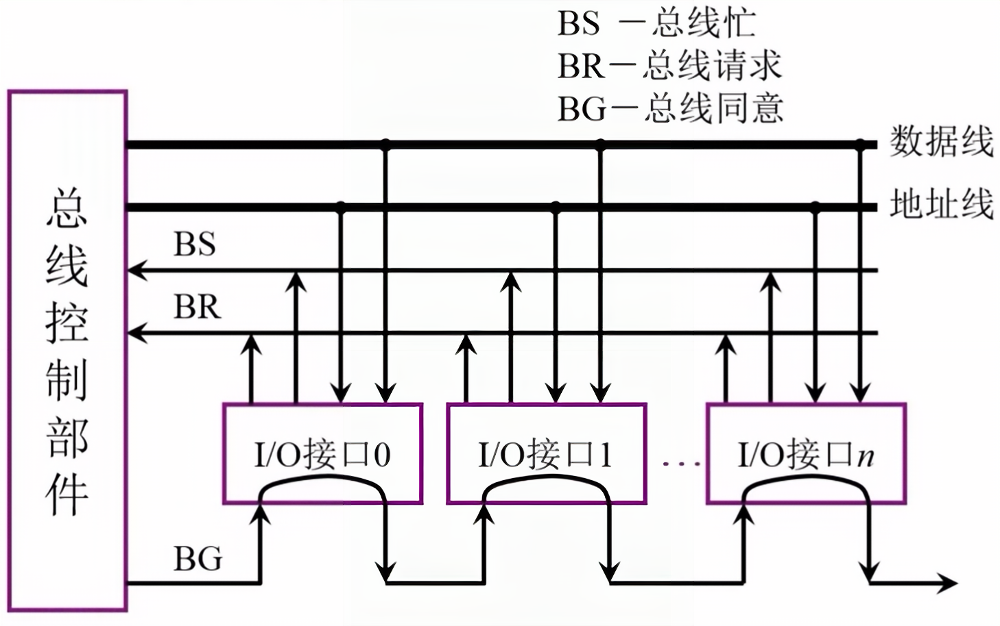
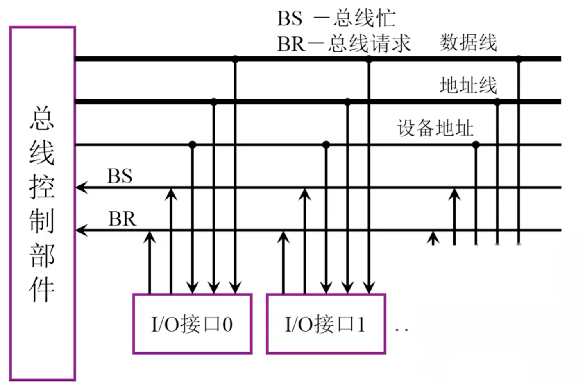
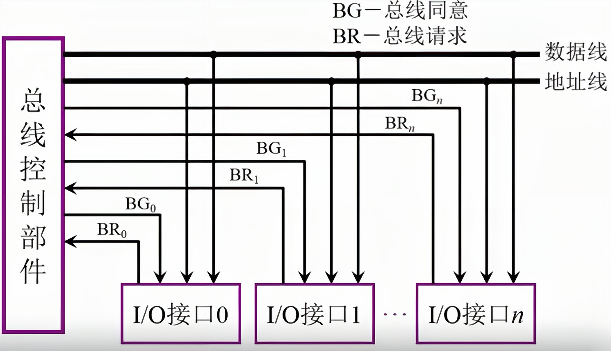

<!--
 * @Author: your name
 * @Date: 2022-04-07 13:47:36
 * @LastEditTime: 2022-04-11 14:28:07
 * @LastEditors: Please set LastEditors
 * @Description: 打开koroFileHeader查看配置 进行设置: https://github.com/OBKoro1/koro1FileHeader/wiki/%E9%85%8D%E7%BD%AE
 * @FilePath: /workspace/MyBlog/计算机组成原理笔记/第三章-系统总线.md
-->

# 系统总线

## 总线的基本概念

### 什么是总线

总线是连接各个部件的信息传输线，是``各个部件共享的传输介质``

### 总线上信息的传输

+ 串行
+ 并行

## 总线分类

1. 片内总线 
+ ``芯片内部``的总线
2. 系统总线
+ ``计算机各部件之间``的信息传输线
   1. 数据总线
   + ``双向``，与机器字长、存储字长有关
   2. 地址总线
   + ``单向``，与存储地址、I/O地址有关
   3. 控制总线
   + ``有出 有入``
3. 通信总线
+ 用于``计算机系统之间``或``计算机系统与其它系统``（如控制仪表、移动通信等）之间的通信

## 总线特性

1. 机械特性
+ ``尺寸``、形状、``管脚数``及``排列顺序`` 
2. 电气特性
+ ``传输方向``和有效的``电平``范围
3. 功能特性
+ 每根传输总线的``功能``(地址、数据、控制)
4. 时间特性
+ 信号的``时序``关系

### 总线性能指标

1. 总线宽度
+ ``数据线``的根数
2. 标准传输速率
+ 每秒传输的最大字节数(MBps)
3. 时钟同步/异步
+ ``同步``、``不同步``
4. 总线复用
+ ``地址线``和``数据线``复用
5. 信号线数
+ 地址线、数据线和控制线的``总和``
6. 总线控制方式
+ 突发、自动、仲裁、逻辑、计数
7. 其他指标
+ 负载能力 

### 总线标准

+ ISA
+ EISA
+ VESA(VL_BUS)
+ PCI
+ AGP
+ RS-232
+ USB

### 总线结构

> PCI

## 总线控制

### 总线判优控制
   
1. 主设备（模块）
+ 对总线有``控制权``
2. 从设备（模块）
+ ``响应``从主设备发来的总线命令
3. 总线判优控制
+ 集中式
  + 链式查询
  + 计数器定时查询
  + 独立请求方式
+ 分布式

> 链式查询

1. I/O接口（1，2）通过BR发出申请信号
2. 总线控制部件通过BG逐一查询，I/O接口（0）未发出申请信号
3. 再次查询，查询到I/O接口（1）发出了申请信号
...

> 计数器定时查询

> 独立请求方式

### 总线通信控制

1. 目的
+ 解决通信双方``协调配合``问题
2. 总线传输周期
   1. 申请分配阶段
   +  ``主模块申请``，总仲裁决定 
   3. 寻址阶段
   + 主模块向从模块``给出地址``和``命令``
   4. 传数阶段
   + 主模块和从模块``交换数据``
   5. 结束阶段
   + 主模块``撤销有关信息``

### 总线同通信的四种方式

1. 同步通信
+ 由``统一时标``控制数据传送
2. 异步通信
+ 采用``应答方式``，没有公共时钟标准
3. 半同步通信
+ ``同步、异步结合``
4. 分离式通信
+ 充分``挖掘``系统总线``每一个瞬间``的潜力（发挥最大效能）
  
#### 同步式数据输入

#### 异步式数据输入

+ 不互锁
+ 半互锁（锁主设备）
+ 全互锁

#### 半同步通信（同步、异步结合）

+ 同步
  + ``发送方``用系统``时钟前沿``发信号
  + ``接收方``用系统``时钟后沿``判断、识别
+ 异步
  + 允许不同速度的模块和谐工作
  + 增加一条``“等待”响应信号`` WAIT

> 以输入数据为例的半同步通信时序

+ T1 主模块发地址
+ T2 主模块发命令
+ Tw 当WAIT为低电平，等待一个T
+ Tw 当WAIT为低电平，等待一个T
+ ......（等待WAIT为高电平）
+ T3 从模块提供数据
+ T4 从模块撤销数据，主模块撤销命令

#### 三种通信的共同点

> 一个总线传输周期（以输入数据为例）

+ 主模块发出地址、命令 ``占用总线``
+ 从模块准备数据 ``不占用总线`` 总线空闲
+ 从模块向主模块发数据 ``占用总线``

#### 分离式通信

> 一个总线传输周期

1. 子周期1
   + ``主模块``申请``占用总线``，使用完后，即``放弃总线``的使用权
2. 子周期2
   + ``从模块``申请``占用总线``，见各种信息送至总线上

> 特点

1. 各个模块有权申请占用总线
2. 采用同步方式通信，不等待对方应答
3. 各个模块准备数据时，不占用总线
4. 总线被占用时，无空闲

