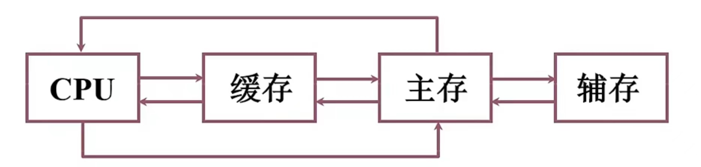
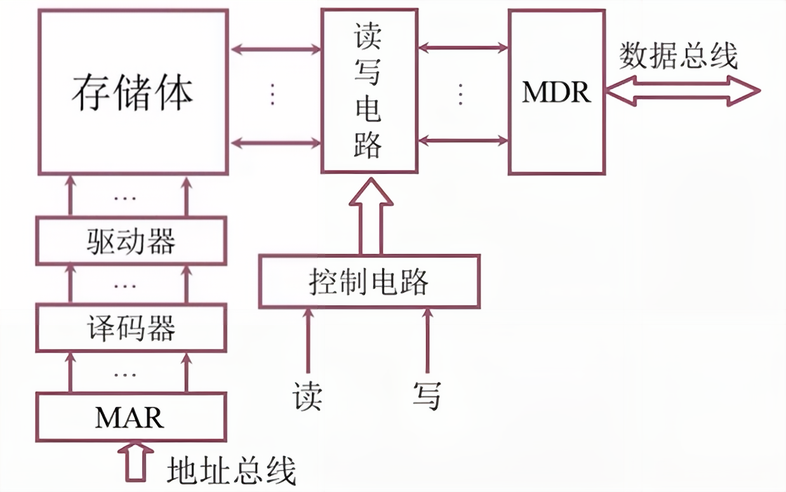
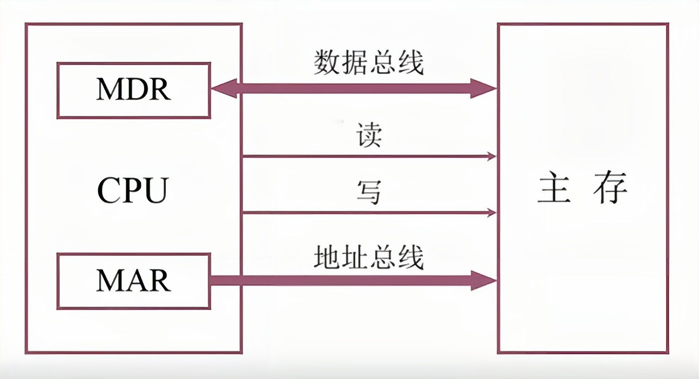
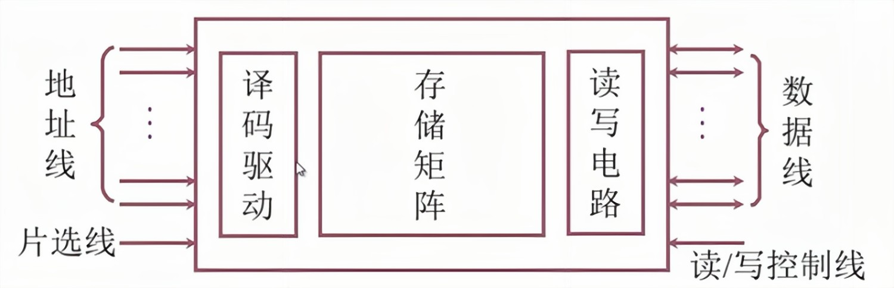
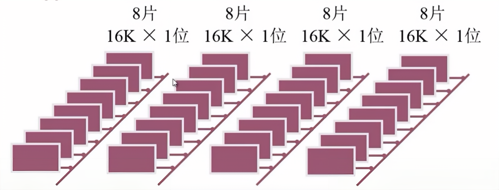
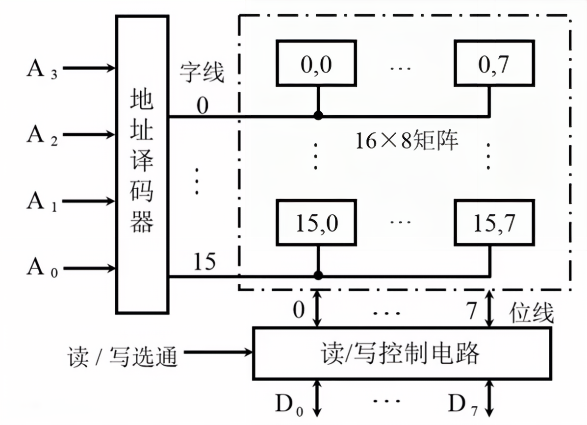
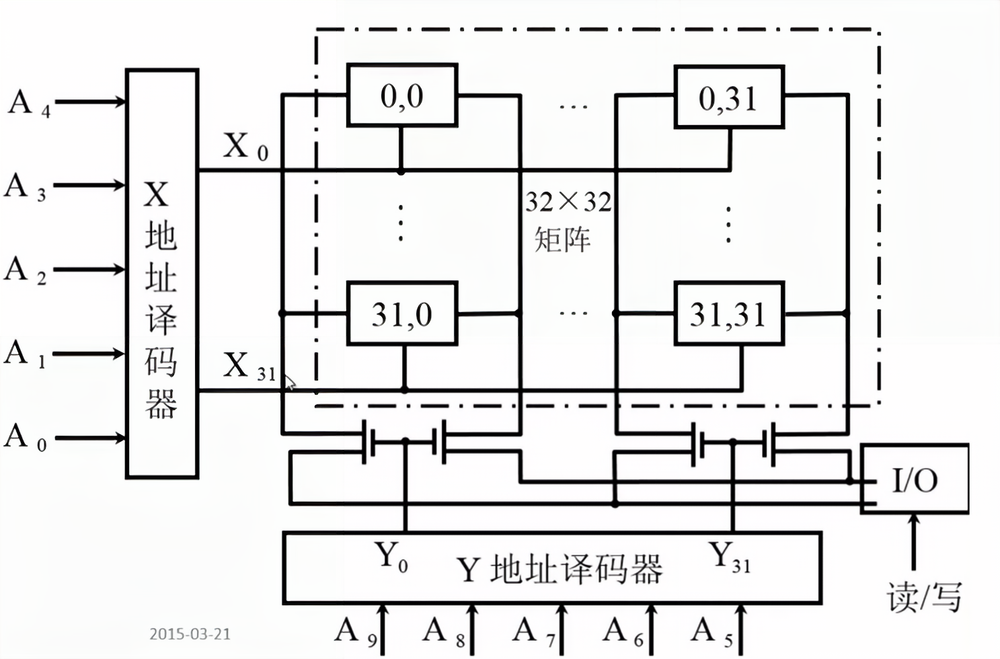
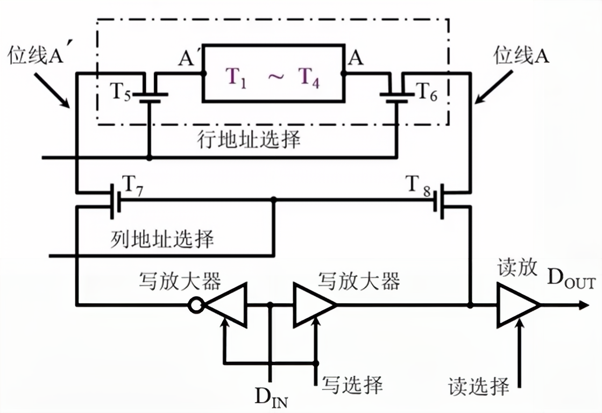

<!--
 * @Author: your name
 * @Date: 2022-04-09 14:48:58
 * @LastEditTime: 2022-04-11 16:17:12
 * @LastEditors: Please set LastEditors
 * @Description: 打开koroFileHeader查看配置 进行设置: https://github.com/OBKoro1/koro1FileHeader/wiki/%E9%85%8D%E7%BD%AE
 * @FilePath: /workspace/MyBlog/计算机组成原理笔记/第四章-存储器.md
-->
# 存储器

## 概述

### 存储器分类

> 按存储介质分类

1. 半导体存储器 ``易失``
    + TTL、MOS 
2. 磁表面存储器 ``非易失``
    + 磁头、磁载体 
3. 磁芯存储器 ``非易失``
    + 硬磁材料、环状元件 
4. 光盘存储器 ``非易失``
    + 激光、磁光材料

> 按存取方式分类

1. 存取时间与物理地址无关（随机访问）
   + 随机存储器
     + ``在程序的执行过程中``可``读``可``写``
   + 只读存储器
     + ``在程序的执行过程中``只``读``  
2. 存取时间与物理地址有关（串行访问）
    + 顺序存取存储器
      + 磁带
    + 直接存取存储器
      + 磁盘

> 按在计算机中的作用分类

1. 主存储器
    + RAM
      + 静态RAM
      + 动态RAM
    + ROM
      + MROM
      + PROM
      + EPROM
      + EEPROM
2. Flash Memory
3. 高速缓冲存储器(Cache)
4. 辅助存储器
    + 磁盘、磁带、光盘

## 存储器的层次结构

### 存储器三个主要特性的关系

+ 寄存器（CPU、主机）
+ 缓存（CPU、主机)
+ 主存（主机）
+ 磁盘（辅存）
+ 光盘（辅存）
+ 磁带（辅存）

1. ``速度``由快到慢
2. ``容量``由小到大
3. ``价格/位``由高到低

### 缓存-主存层次和主存-辅存层次

缓存作为一个透明的存在，不直接操作缓存。

> 主存+辅存 -> 虚拟存储器 

主存和辅存构成的虚拟储存器构成了新的虚拟地址储存空间（``虚地址``、``逻辑地址``）

程序执行的时候由特定的机构将逻辑地址转化为主存单元的地址。

> 缓存+主存

缓存和主存使用的地址使用的是主存的地址。

在程序执行中，及时指令是在缓存中的。其中获得到得主存的地址，经过转换得到缓存中的块和块内偏移地址。

主存中的地址是``实地址``,也就是物理地址。

## 主存储器-概述

### 主存的基本组成

### 主存和CPU的联系

### 主存中存储单元地址的分配

+ 存储字长32位（一次读出或写入32个0/1）
+ 编址单位为字节

> 0x12345678在主存储器中的存储方式

+ 0x12345678长度为32(8*4)位，恰好保存在一个存储单元中
+ 1个字节为8位，能存放2位16进制数

> 大端、大尾方式

``高位字节``地址位为字地址

|字地址|字节地址0|字节地址1|字节地址2|字节地址3|
|--|--|--|--|--|
|0|12|34|56|78|
|4|||||
|8|||||

> 小端、小尾模式

``低位字节``地址位为字地址

|字地址|字节地址0|字节地址1|字节地址2|字节地址3|
|--|--|--|--|--|
|0|78|56|34|12|
|4|||||
|8|||||

设地址线``24``根，按``字节``寻址 224 = 16MB

若字长为``16``位，按``字``寻址 ``8MW``（M*字长）

若字长为``32``位，按``字``寻址 ``4MW``（M*字长）

### 主存的技术指标

1. 存储容量
  + 主存存放二进制代码的总位数
2. 存储速度
  + 存取时间
    + 存储器的``访问时间``
    + 读出时间/写入时间
  + 存取周期
    + ``连续两次独立的存储器操作``
    + (读或写)所需的``最小时间间隔``
    + 读周期/写周期
3. 存储器的带宽
  + 位/秒

## 主存储器-半导体芯片

### 半导体存储芯片的基本结构

|地址线(单向)|数据线(双向)|芯片容量|
|--|--|--|
|10|4|1K*4位|
|14|1|16K*1位|
|13|8|8K*8位|

+ 片选线
   + $\overline{\text{CS}}$ $\overline{\text{CE}}$
+ 读/写控制线
  + $\overline{\text{WE}}$ (低电平写 高电平读)
  + $\overline{\text{OE}}$ (允许读) $\overline{\text{WE}}$ (允许写)  

> 储存芯片片选线的作用

用16K\*1位的储存芯片组成64\*8位的存储器

### 半导体存储芯片的译码驱动方式

> 线选法

> 重合法

### 随机存取存储器(RAM)

#### 静态RAM(SRAM)

T1~T4 触发器

T5 T6 行开关

T7 T8 列开关

T7 T8 一列公用

A 触发器原端

A' 触发器非端

> ``读``操作

+ 行选 -> T5 T6开
+ 列选 -> T7 T8开
+ 读选择有效

VA -> T6 -> T8 -> 读放 -> DOUT

> ``写``操作

+ 行选 -> T5 T6开
+ 列选 -> T7 T8开
+ 写选择有效

(左) DIN -> 反向 -> T7 -> T5 -> A'

(右) DIN -> T8 -> T6 -> A

