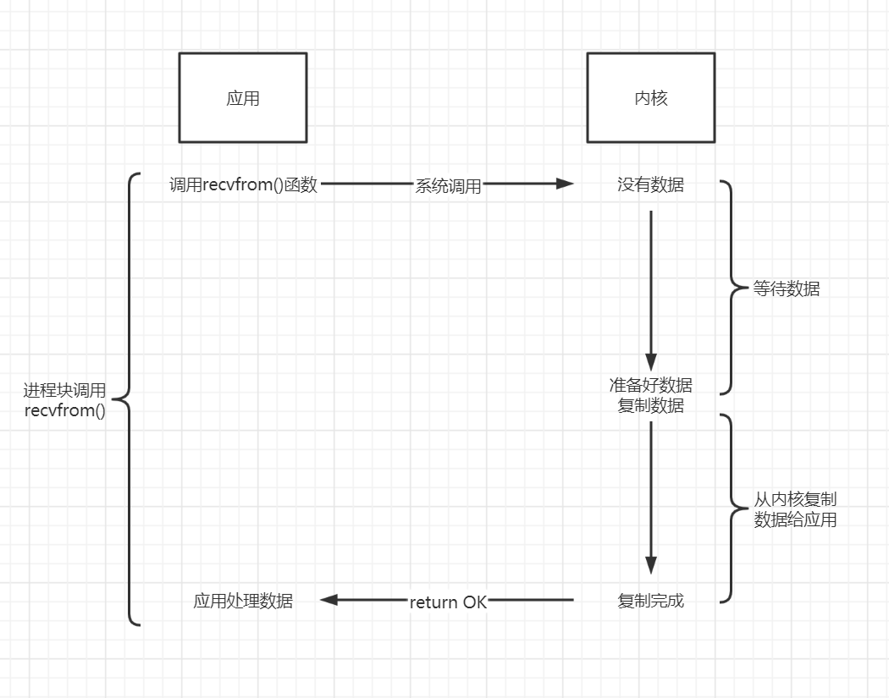
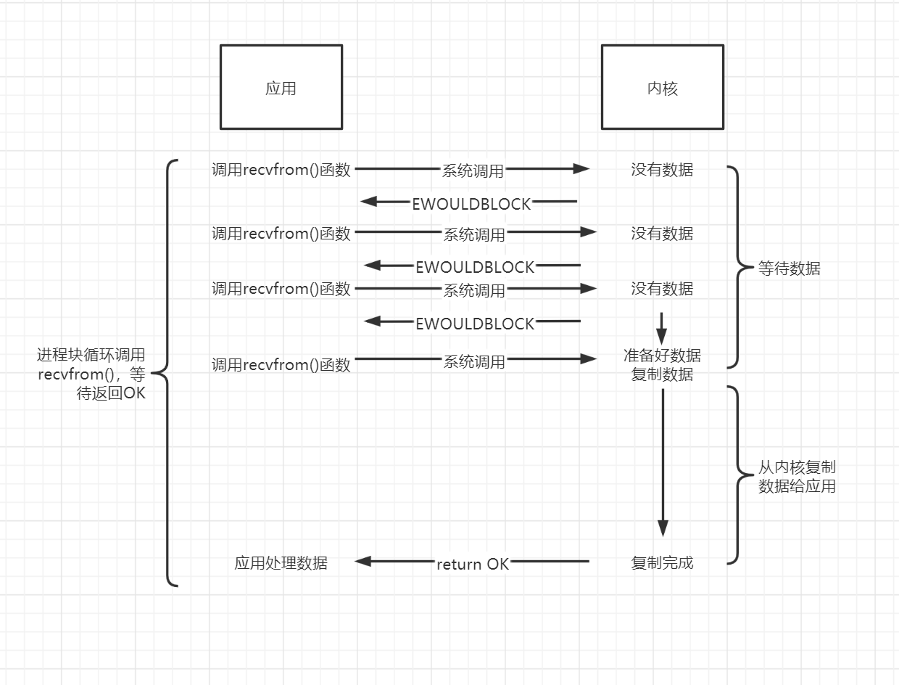
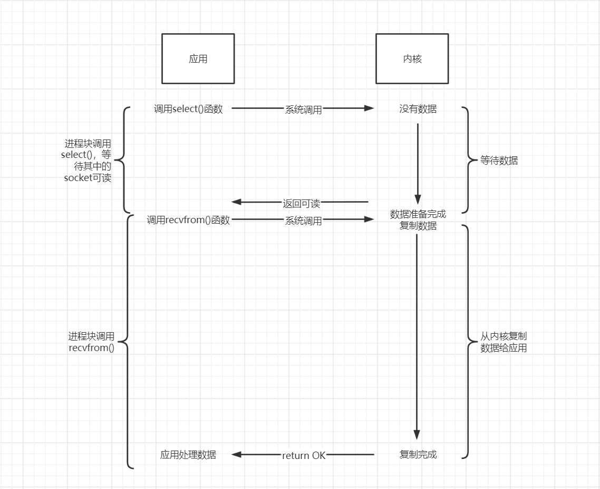
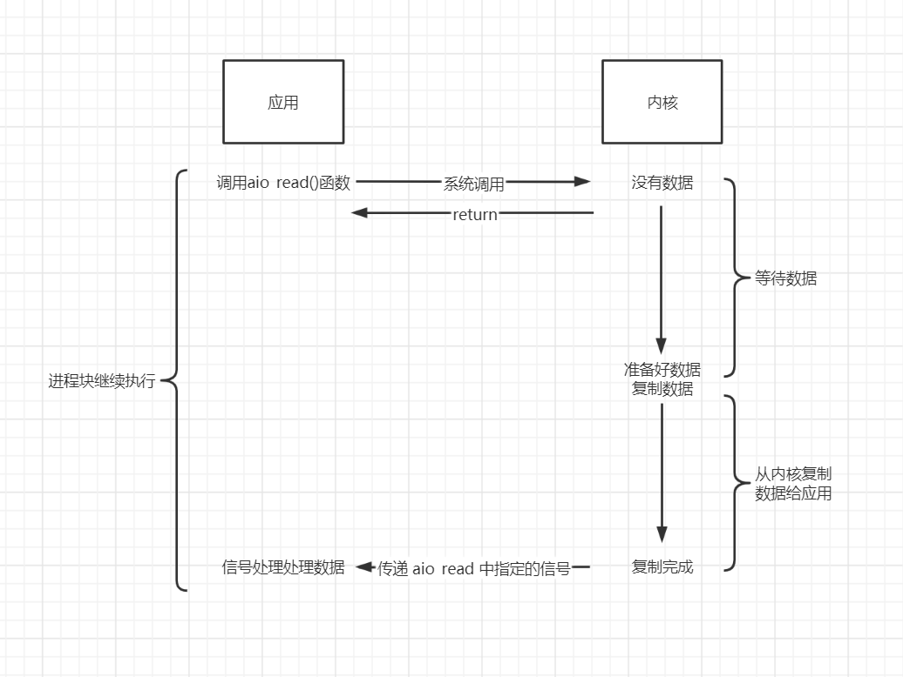
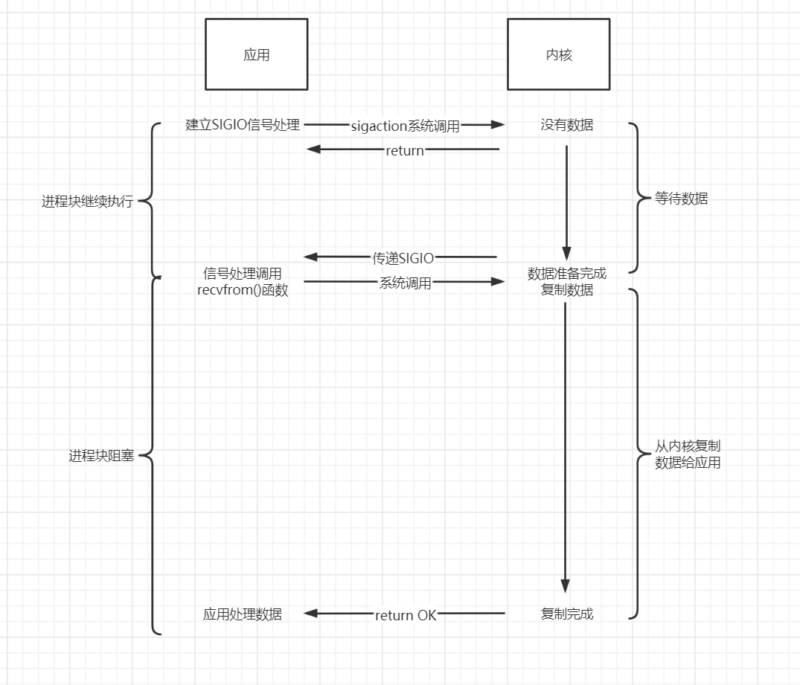

<!--
 * @Author: your name
 * @Date: 2021-12-13 13:51:59
 * @LastEditTime: 2022-04-01 16:38:32
 * @LastEditors: Please set LastEditors
 * @Description: In User Settings Edit
 * @FilePath: /workspace/Studynote/网络开发笔记/其他.md
-->
# I/O模型

+ Blocking I/O (阻塞IO)
+ NonBlocking I/O (非阻塞IO)
+ Multiplexing I/O (IO多路复用)
+ Asynchronous I/O (异步IO)
+ Signal Driven I/O (信号驱动IO)

## Blocking I/O I/O (阻塞IO)

Blocking I/O 也叫BIO， 也就是阻塞IO。

从图中可以看出当进程了调用了recvfrom的系统调用，kernel就开始了进行IO操作了，这个操作就是准备数据。而这个准备数据是需要一个过程的，内核需要获取数据，需要等待数据被拷贝到内核空间，然后再将数据从内核空间拷贝到用户空间。这其中涉及到两个过程，一个就是操作系统内核需要等待数据被拷贝到内核空间，另一个过程就是将数据从内核空间拷贝到用户空间。在这个阻塞IO模型中，在数据还没到达用户空间之前，这两个过程都是阻塞的，一直处于Blocking的状态。

## Multiplexing I/O (IO多路复用)

EWOULDBOCK = EAGAIN (这表明你在非阻塞模式下调用了阻塞操作，在该操作没有完成就返回这个错误，这个错误不会破坏socket的同步，不用管它，下次循环接着recv就可以。)

NonBlocking I/O 也叫NIO，也就是非阻塞IO。

NIO则是直接先返回一个error告知进程数据还没准备好。同样的在进程端，也不用一直傻傻的等待，当得到一个数据还没准备好的错误时，会再次发送系统调用，直到内核准备好了数据，再从内核空间将数据拷贝到用户空间。

## Asynchronous I/O (异步IO)

操作系统提供了一个叫select的系统调用，当一个进程调用了select，则该用户进程所负责的所有socket同样被select所负责。对于内核，则监听着所有select负责的socket。当调用了select之后，select会不断的轮询所有的socket，当某个socket有数据到达了，select就会返回，告知进程将数据拷贝从内核空间拷贝到用户空间。

## Asynchronous I/O (异步IO)

Asynchronous IO 也叫AIO，也就是异步IO。

异步IO就是当用户进程发起了一个系统调用之后，内核直接返回error，而用户进程接收到返回后，不再等待直接干其她事情去了。剩下的数据准备工作内核就自己去干了，等数据准备好了，不再通知用户进程来拷贝数据，而是自己顺手将数据从内核空间拷贝到用户空间。当所有事情都做完之后，只需要给用户进程发送一个信号【Signal】，告知到用户进程直接读取数据就行了。

## Signal Driven I/O (信号驱动IO)

在该模型中，从图中可以看出当进程调用了系统调用后，该模型会给对用的socket请求建立一个信号处理器，进程并不会被挂起。当内核准备好数据时，内核就会产生一个SIGIO信号给之前建立好的信号处理器，然后信号处理器就可以进行读写操作。

## 同步异步

同步的概念是，一个任务的执行过程涉及到的步骤或者个体，它们是一种前后顺序都安排好的依赖关系，当一个步骤或者个体出现问题时，该顺序不可调，只能等着；而异步的概念则相反，没有严格的前后顺序和依赖关系。也就说同步异步表达的是顺序和依赖关系。

## 阻塞非阻塞

阻塞与非阻塞的概念是，一个任务的执行过程涉及到的步骤或者个体，它们在执行任务的过程中，其中的一个步骤或者个体出现问题时，剩下的是一直等着啥事也不干，还是跑去干其他事情去了。也就是说，阻塞非阻塞表达的是等待时的状态

## IO与同步异步和阻塞非阻塞
|      | 阻塞                 | 非阻塞 |
| ---- | -------------------- | ------ |
| 同步 | BIO/Multiplexing I/O | NIO    |
| 异步 |                      | AIO    |

## select/poll/epoll

select/poll/epoll都是实现Multiplexing IO的三种不同的方式。最大的区别在于性能上，select/poll是O(N)时间复杂度，epoll则是超高效率的O(1)时间复杂度。

