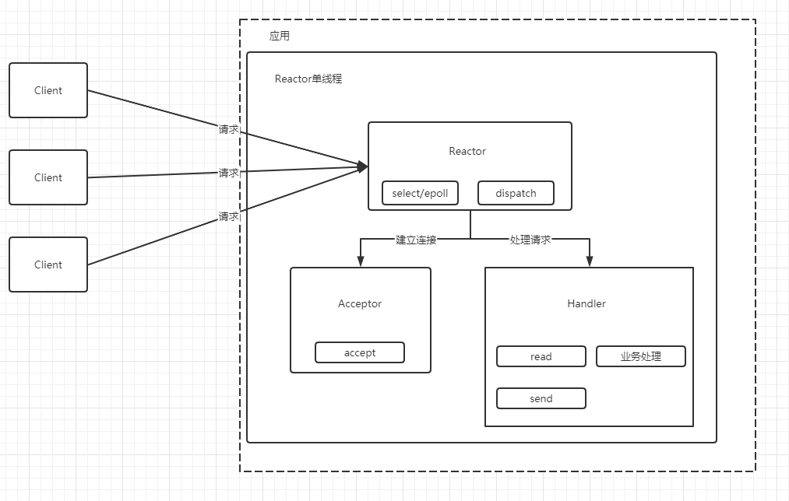
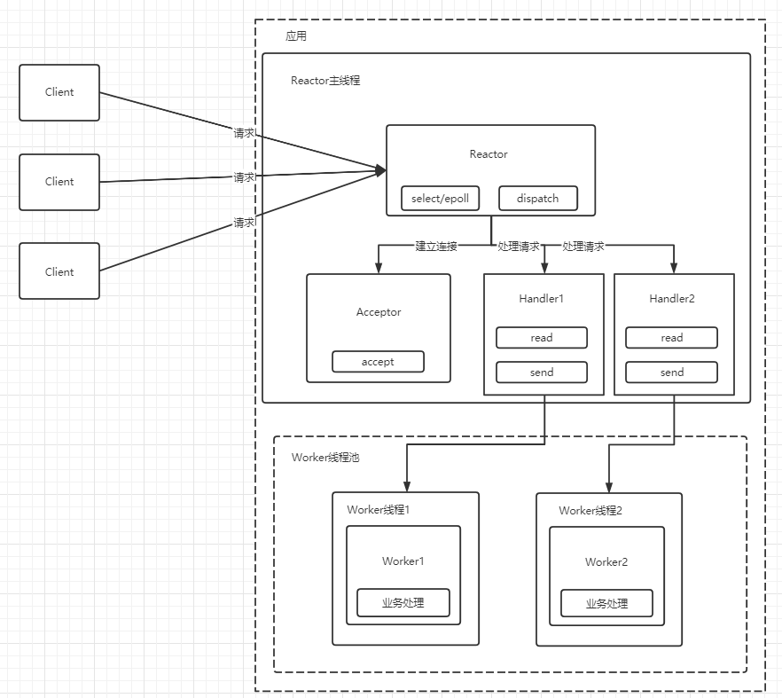
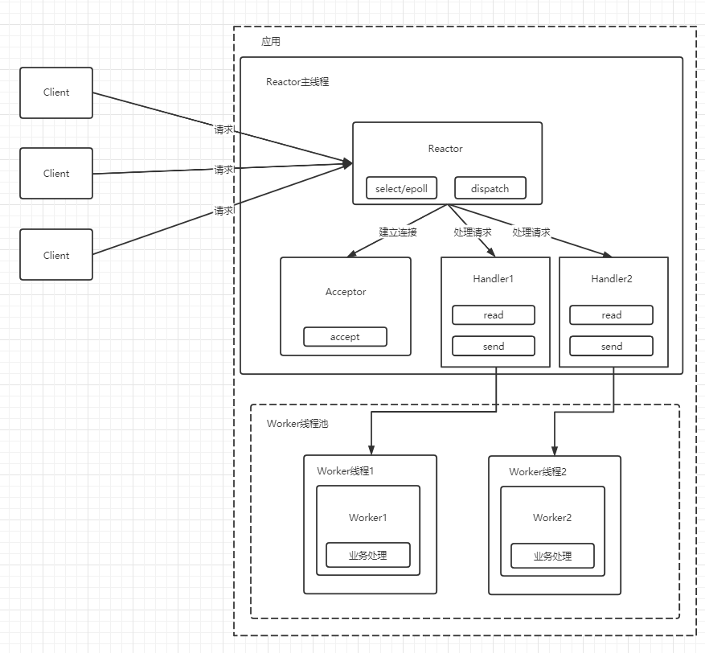

<!--
 * @Author: your name
 * @Date: 2022-04-21 17:25:07
 * @LastEditTime: 2022-04-25 16:34:42
 * @LastEditors: Please set LastEditors
 * @Description: 打开koroFileHeader查看配置 进行设置: https://github.com/OBKoro1/koro1FileHeader/wiki/%E9%85%8D%E7%BD%AE
 * @FilePath: /workspace/MyBlog/计算机网络笔记/其他-Reactor模型.md
-->
# Reactor模型

## 单线程Reactor模型

## 多线程Reactor模型

## 多线程多Recator模型

